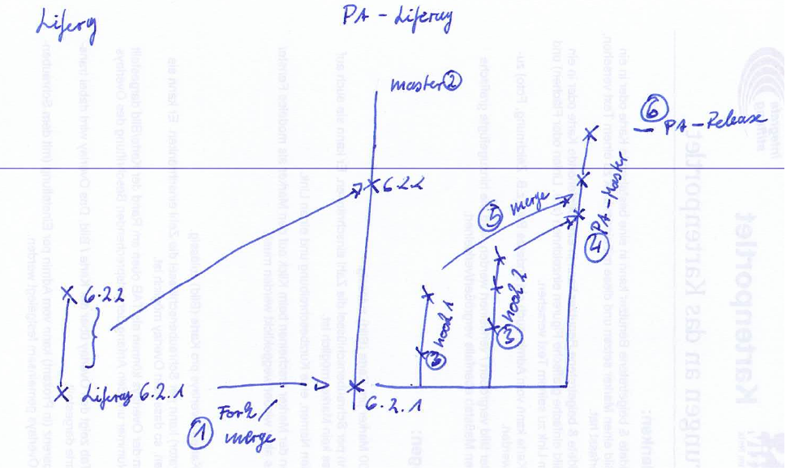
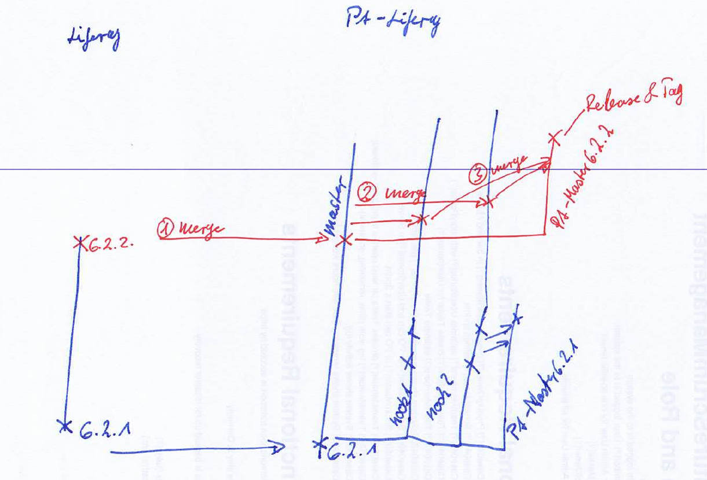

# Architecture
## Hookless Liferay Core Build
### Organize several Hooks in Branches

1. We will merge the Liferay Release to our own organisation PolitAktiv
2. The branch which stays in sync with liferay will be __master__
3. Each hook will have it's own branch starting with the first fork. These branches will have the hook names.
4. The PolitAktiv releases will stay on it's own branch called __PA_master[LR-Release-Tag]__
5. We will merge all the hooks to the PolitAktiv release branch
6. Releases will be tagged on the PolitAktiv release branch

### Upgrade to a new Liferay Release

1. We will merge Liferays changes to the PolitAktiv Fork / __maste__ branch.
2. We merge the __master__ branch to the existing hook branches
3. We create a new PolitAktiv releases branch called __PA_master[LR-Release-Tag]__ and merge the hook branches to the new release branch
4. We release the new PolitAktiv release.

### Give sth. back
How to provide pull requests back to liferay ...

## Store Artefacts for Deployment

## Build additional Artefacts (Portlets / Themse / Layouts)

